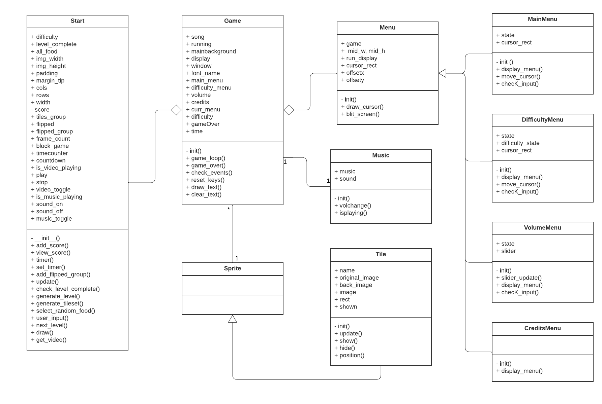

<div align="center">

# MEMORY-GAME BY EXIATOMA
  
  <a href="https://www.pygame.org/"></a>
</div>


# Description

This is an food-base memory tile game. The objective of this game is aims to hone one's memory by giving a game in the form of cards that are matched with pictures. The user must find a card with the same food picture and then click simultaneously so that the card is paired. The higher the level, the faster the time, so the user must play and analyze which images are the same. 
Are you ready for this game? Let's complete the level and prove your skills!

## Dependencies (Library)
- `pygame`          : Main library to operates the game
- `pygame_widgets`  : Library to create slider in Volume menu
- `random`          : Library to handle all random function
- `os`              : Library to interact with operation system
- `cv2`             : Library to show the background of in game

## Prerequisites
This game requires Python 3.10+ in order to run. Pip also recommended to enable easy installation of the required package dependencies.

### Install pygame and pygame-widgets using PiP
```
pip install pygame
pip install pygame-widgets
```

### Install opencv_python using PiP
```
pip install opencv-python
```

### How To Operate The Game
```
python main.py
python3 main.py (alternative command)
```

## Gameplay

## Game Terms
- User can choose the difficulty as desired.
- The target to complete this game is to find cards that have the same picture.
- Each user finishes finding a card that has the same image then the user will get a score.
- When the user completes a game, the user will get a bonus timer of 30 seconds (easy), 50 seconds (medium), 70 seconds (hard).

## Game Control
- `Arrow Key` : Move to select something on Main Menu
- `ENTER`     : Use for approve selection on the Main Menu
- `SPACE`     : Use as `Next` when the game start
- `BACKSPACE` : Use for back to previous activity


## UML CLASS DIAGRAM



## Group Members:
| EXIATOMA TEAM |
| ---------------- |

| Nama | NIM | Github |
| :---: | :---: | :---: |
| Jesika Putri               | 120140050 | [JESIKAPUTR123](https://github.com/JESIKAPUTR123)  |
| Hilmanda Panji Orienski    | 120140130 | [hilmanda](https://github.com/hilmanda)            |
| Bilhaq Avi Dewantara       | 120140141 | [BilhaqAD07](https://github.com/BilhaqAD07)        |
| Gery Melia Suwanda         | 120140147 | [GeryMs19](https://github.com/GeryMs19)            |
| Fadhilah Fauza Hamda       | 120140153 | [fadhilahfauza](https://github.com/fadhilahfauza)  |
| Chaterine Sidabutar        | 120140199 | [ChaterineS](https://github.com/ChaterineS)        |
